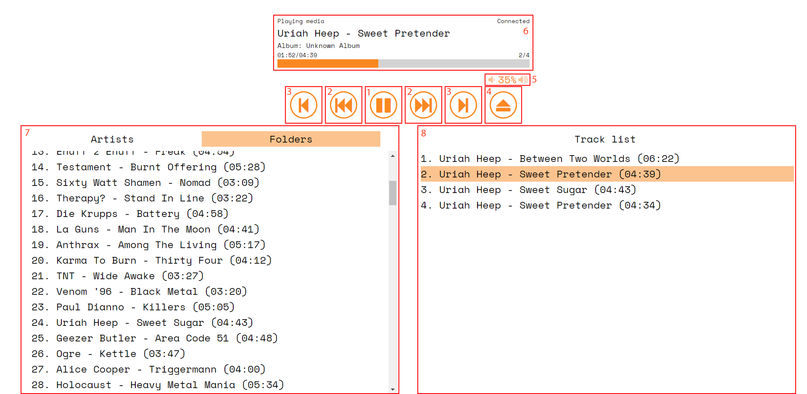

# raspberry-pi-cdplayer

Raspberry Pi CD/MP3 player usable with PiFace CAD 2 and with web/mobile interface. It autoplays audio and MP3 CDs and MP3s from USB disks and is controllable from web interface, Android app or PiFace CAD 2 module (including IR remote controll).
Written in Python/React/React Native.
Made as a bachelor's thesis at University of South Bohemia.

## Requirements

* Raspberry Pi 3 (tested)
* USB CD/DVD drive
* PiFace CAD 2 (optional)
* external sound card (optional)
* At least 2 A power supply (only if your CD/DVD drive is powered from USB)
* Raspbian Stretch (tested)

## Instalation

1) Download the newest release of raspberry-pi-cdplayer from [here](https://github.com/ivankrato/raspberry-pi-cdplayer/releases) or [build](#build) your own.

2) Increase USB current limit (only if your CD/DVD drive is powered from USB)
```bash
echo 'max_usb_current=1 >> '/boot/config.txt'
```

3) Set your default sound card (skip if you don't use external sound card)

Create file ~/.asoundrc with this content. The card number is 1 in case of external USB sound card
```
pcm.!default {
    type hw
    card <sound card number>
}

ctl.!default {
    type hw           
    card <sound card number>
}
```

4) Set the volume of your sound card to 100%.
```bash
amixer -c <sound card number> set Speaker playback 100% unmute
```

5) Install required packages
```bash
sudo apt install mpv eject cd-discid socat lirc
sudo pip3 install mutagen flask flask-socketio pyudev
```

**You can [skip](#configuration) next steps if you don't use PiFace CAD 2**

6) Enable SPI interface in raspi-config (skip if you don't use PiFace CAD 2)

```bash
sudo raspi-config
```

7) Build and install packages which aren't in the repository
```bash
sudo apt install liblircclient-dev cython gcc
git clone https://github.com/tompreston/python-lirc.git
cd python-lirc
make py3 && sudo python3 setup.py install
cd ..
git clone https://github.com/piface/pifacecommon.git
cd pifacecommon
sudo python3 setup.py build && sudo python3 setup.py install
cd ..
git clone https://github.com/piface/pifacecad.git
cd pifacecad
sudo python3 setup.py build && sudo python3 setup.py install
cd ..
```

8) Set up lirc
```bash
wget https://raw.github.com/piface/pifacecad/master/bin/setup_pifacecad_lirc.sh 
chmod +x setup_pifacecad_lirc.sh
sudo ./setup_pifacecad_lirc.sh
wget -O lirc-old2new https://sourceforge.net/p/lirc/git/ci/debian/tree/debian/lirc-old2new?format=raw
chmod +x lirc-old2new
sudo ./lirc-old2new
sudo reboot
```

9) Set up your IR remote control
```bash
irrecord remote.lircd.conf
sudo mv remote.lircd.conf /etc/lirc/lircd.conf.d/remote.lircd.conf
sudo rm /etc/lirc/lircd.conf.d/devinput.lircd.conf
sudo systemctl restart lircd.socket lircd
```

## Configuration

The configuration of the application is in the media_player.conf file. You can change the name of the device (this name is then used by lirc), IP and PORT of the web interface, mpv unix socket path, CD/DVD drive device name, USB flash disk device name and default playback volume.

You don't have to configure anything, the application should work without changing the file.

If you want to use remote control with lirc, you have to create ~/.lircrc file. Check the .lircrc.example file how to configure it.

## Usage

Run main.py with python3.

```bash
python3 main.py
```

The program now autoplays any audio CD or CD/DVD/USB disk with MP3s on them. You can control the playback by buttons on PiFace CAD 2, IR remote control, from web interface or Android application - just install the .apk file in mobile_client folder.

### Hardware buttons


1) Previous folder/artist/album
2) Next folder/artist/album
3) Volume down
4) Volume up
5) Eject disc/unmount usb drive and stop playback
6) Next song in playlist
7) Previous song in playlist
8) Play/pause

### Web interface

Just put your Raspberry Pi's http://ip:port/ to your browser. Default port is 51234. The insterface is fully reponsive, so it works on any mobile device.



1) Play/pause button
2) Previous/next song in playlist
3) Previous/next folder/artist/album in library
4) Eject button - stopsthe playback and eject the CD/DVD from the drive
5) Volume controls
6) Playback informations - you can click the seeker to seek time
7) MP3 media library - by folders or artists/albums (from ID3 tags)
8) Current playlist

### Android application

The application consists of 3 screens. List of your Raspberry Pi CD players, edit screen of the list record and control screen, which is the same as web interface. You can also control the playback from notification.


**Home screen**

1) List of added Rasberry Pi CD players - touching it opens edit screen
2) Button to connect to the last connected Raspberry Pi
3) Add Raspberry Pi to the list button - opens edit screen

**Edit screen**

4) IP address input
5) Port input
6) Save record button
7) Delete record button
8) Connect to the inserted IP address and port


**Control screen**
1) Opens and closes MP3 media library
2) Opens and closes current playlist
3) The rest is the same as in the web interface

## Build

If you want to build the application on your own, just run build.bat (Windows) or build.sh (Bash) script. You will need to have *node.js* with *npm* installed.

## Case

If you need a case for Raspberry Pi 3 with PiFace CAD 2 and you have an access to 3D printer, there are .stl files in the [case_stl folder](case_stl/). Thanks to [my thesis supervisor](https://github.com/jipech) for creating them.
